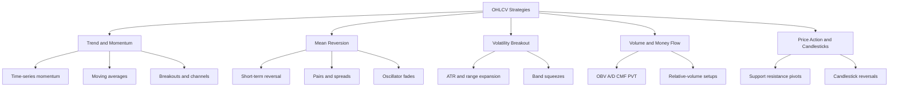

# Top 50 OHLCV Trading Strategies

## Executive summary

A literature-weighted ranking of OHLCV-only strategies puts simple, transparent trend and momentum rules at the top. The strongest recurring evidence is for time-series momentum, long-horizon moving-average filters, Donchian or trading-range breakouts, cross-sectional momentum, and dual-momentum variants, because these rules have unusually long research pedigrees, relatively low parameter counts, and evidence across markets rather than in only one niche sample. AQR’s century-long trend-following study finds consistent profitability back to 1880, Moskowitz, Ooi, and Pedersen document time-series momentum across 58 liquid futures, Brock, Lakonishok, and LeBaron find support for moving-average and trading-range-break rules on the DJIA from 1897 to 1986, and Antonacci’s dual-momentum work shows the practical benefit of combining absolute and relative momentum. citeturn20view0turn21search2turn26view3turn20view10

The next tier is dominated by mean-reversion and relative-value constructions that are strong but less universally robust once turnover, execution, and capacity are considered. Pairs trading ranks highly because the classic Gatev–Goetzmann–Rouwenhorst distance framework produced economically meaningful six-month excess returns in 1963–1997, while short-horizon reversal and overnight-to-intraday reversal remain important because they are closely tied to liquidity provision and investor-clientele effects. Intraday breakout rules such as opening-range breakout can work, but published evidence is more regime-sensitive and less stable across subperiods than the best medium-horizon trend rules. citeturn26view0turn26view1turn20view5

Volume, oscillator, and candlestick rules still matter, but mainly as lower-ranked standalone strategies or as filters and confirmation layers. Volume has genuine informational content in theory and data, and some single-market candlestick studies find profitable patterns, yet the broad evidence base is much less uniform than for trend and momentum; overfitting, transaction costs, and changing market efficiency are major reasons. Park and Irwin’s review finds the literature mixed, Park and Irwin’s U.S. futures reality check leaves only 2 of 17 markets significant after data-snooping correction, Brogaard and Zareei find technical-rule profitability decays through time, and Chen and Velikov show that the average published anomaly’s expected return is very small after costs, data mining, and post-publication effects are considered. citeturn22search13turn30search0turn31view0turn31view1turn20view2turn20view3turn28view0

## Methodology and ranking criteria

This report uses only strategies implementable from past price bars and volume, with daily data assumed unless the rule is intrinsically intraday, such as VWAP or opening-range breakout. Universe-level strategies such as cross-sectional momentum and pairs trading are included because they still require only OHLCV histories across multiple assets. Where official indicator specifications were needed, I prioritized TA-Lib and platform documentation; where empirical performance mattered, I prioritized original academic papers, exchange-quality or institutional research, and major peer-reviewed reviews. Because technical-analysis research often uses inconsistent universes, costs, and rebalance assumptions, I only quote hard empirical metrics when the cited source provides a clear sample context; otherwise the empirical-metric field is effectively **unspecified** by design, to avoid false precision. citeturn17search12turn4search0turn4search2turn8search3turn15search1turn16search5

The ranking is a qualitative composite with roughly three inputs: empirical efficacy under published tests, popularity in literature and practice, and robustness to overfitting. In practice, that means high ranks go to parsimonious rules with long out-of-sample histories, cross-asset applicability, and simple decision logic; lower ranks go to strategies that are highly parameter-sensitive, heavily intraday, strongly regime-dependent, or whose historical evidence weakens materially after data-snooping and cost adjustments. citeturn20view2turn20view3turn19search29turn22search4turn28view0

## Strategy taxonomy

The ranked set naturally clusters into five families. Trend and momentum dominate the upper ranks because they are both the most heavily studied and the least reliant on visually fitted rules; mean-reversion sits next because short-horizon reversals and relative-value convergence are real but execution-intensive; volatility-breakout and compression rules are useful when markets transition from quiet to directional states; volume rules are informative but often work best as confirmers; and pure price-action or candlestick rules remain popular yet less robust across markets and eras. citeturn20view0turn21search2turn22search13turn31view0

in folder strategies/ implemnt Time Series Momentum Trading Strategyhttps://www.econ.cam.ac.uk/sites/default/files/publication-cwpe-pdfs/cwpe1322.pdf

as a result make one grapgh with base sp500 candles with black color, and 10 diffrent combinatios of this strategy all in grey except the best one with green color, do 50 of diffrent combinations but on chart show best 10 and strategy should start with 10k zl follwoing this strategy on shwoing balance

## Ranked top 50 strategies

Field shorthand below is: **O** open, **H** high, **L** low, **C** close, **V** volume. Indicator input mappings follow official TA-Lib and platform documentation; timeframes are the most typical, not the only valid ones. citeturn4search0turn4search2turn8search3turn15search1turn16search5

1. **Time-series momentum** — Go long an asset when its own trailing return is positive and short or flat when negative, typically from **C** over 3–12 months with monthly rebalancing; it has the best cross-asset evidence, tends to earn convex, crisis-sensitive payoffs but suffers in violent reversals, enters and exits on return-sign flips, and common variants add volatility scaling or ATR-based stops. citeturn21search2turn20view0

2. **200-day SMA absolute trend filter** — Hold the asset only when **C** is above a 10-month or 200-day moving average and de-risk when below; it is parameter-light, usually daily-to-monthly, strongest for drawdown control rather than raw upside, enters and exits on close crossovers, and variations use EMA, monthly confirmation, or safe-asset rotation. citeturn20view7turn26view3

3. **Donchian channel breakout** — Buy a close above the highest recent **H** and sell or short below the lowest recent **L**, commonly over 20–55 bars; it is a classic low-win-rate, high-payoff trend rule with concise stop-and-reverse logic, and the main variations are Turtle-style asymmetric entry and exit windows plus ATR sizing. citeturn6search15turn22search12turn12search22

4. **Cross-sectional momentum** — Rank a universe by trailing **C** returns, buy recent winners and short or underweight losers, usually on monthly or quarterly schedules; it is one of the most replicated anomalies but has crash risk and crowding risk, entry and exit are periodic re-ranks, and common variations use industry, sector, or volatility filters. citeturn11search1turn30search14turn23search4

5. **Dual momentum** — Combine absolute momentum with relative momentum by first requiring positive own-trend and then selecting the strongest asset or sector by trailing **C** return; it typically reduces drawdowns versus pure relative strength, exits on either absolute-trend failure or ranking loss, and variations differ mainly in lookback horizon and asset set. citeturn20view10turn11search1

6. **Multi-horizon trend factor** — Blend several moving-average distances or other multi-horizon **C**-based trend signals into a composite long or short score; this is more diversified than any single lookback, tends to be smoother and more robust than one-horizon momentum, and common variants weight short, intermediate, and long horizons equally or by forecast strength. citeturn27search0turn27search2turn27search5

7. **Dual moving-average crossover** — Go long when a short MA of **C** rises above a long MA and exit or short on the reverse crossover, with common pairs such as 20/50, 50/200, or other fast/slow combinations; it is transparent and popular but whipsaw-prone in ranges, and variations include EMA instead of SMA, signal buffers, or volatility filters. citeturn22search12turn33search5

8. **52-week high breakout** — Buy assets whose current **C** is near or above the prior 52-week high and exit when that proximity deteriorates or the breakout fails; it is a momentum variant with strong literature support, usually weekly-to-monthly, and common variations use nearness scores, breakout confirmation, or sector-relative filters. citeturn36search0turn36search6

9. **Distance or z-score pairs trading** — Form pairs from historically similar price paths using **C**, go long the relative loser and short the relative winner when the spread widens materially, and exit on spread mean reversion; it is a mean-reversion relative-value strategy with execution and borrow frictions, and in the original 1963–1997 sample the top portfolios earned mean six-month excess returns of roughly 4.1%–6.0% on committed capital. citeturn26view0

10. **Short-term close-to-close reversal** — Buy recent **C** losers and short recent winners over very short horizons, usually one day to one week; the edge is linked to liquidity provision and is high turnover and capacity-constrained, entries and exits are simple periodic re-sorts, and variations use overnight or intraday decomposition, volatility scaling, or universe liquidity filters. citeturn24search0turn24search1turn30search17

11. **Overnight-intraday reversal** — Buy assets with weak overnight performance and fade them during the next intraday session, or symmetrically sell strong overnight winners, using **O** and **C**; this is an intraday mean-reversion rule tied to market-closure liquidity effects, entry is at the open and exit is typically by the close, and variations use futures, equities, or cross-asset baskets. citeturn26view1turn25search14

12. **Trading-range breakout** — Enter when price breaks a prior multi-bar range, normally using recent **H** and **L** with close confirmation, and exit on opposite break, trailing stop, or range failure; it is closely related to channel breakout but broader in implementation, performs best in directional markets, and common variants add confirmation filters or waiting rules. citeturn22search12turn12search14turn12search22

13. **ATR or NATR volatility breakout** — Trigger trades only when price exceeds a recent level by a multiple of ATR or when realized bar range expands sharply, using **HLC**; this is a trend-volatility hybrid with fewer false breakouts than pure price levels but greater lag, and common variants differ in ATR length, breakout multiple, and trailing-stop formula. citeturn4search1turn20view0

14. **MACD crossover** — Go long when MACD on **C** crosses above its signal line or moves above zero and exit on the reverse; the rule is highly popular, medium-term, and more reliable in trends than in chop, with common variations using signal-line, zero-line, or histogram triggers. citeturn4search2turn20view4

15. **ADX plus DI trend strategy** — Use **ADX** on **HLC** to require a strong trend and then take direction from +DI versus −DI crosses; it filters many low-quality breakout signals, tends to trade less often than MACD or MA crossovers, and common variations change the ADX threshold or pair it with channels. citeturn4search2turn20view2

16. **Bollinger-band mean reversion** — Fade closes that stretch beyond the upper or lower band around a moving average of **C**, usually with 20 bars and 2 standard deviations; it works best in non-trending regimes, is vulnerable to “band walks” in persistent trends, and variants use band touches, closes back inside the band, or RSI confirmation. citeturn5search0turn5search9turn20view2

17. **RSI reversal** — Buy oversold and sell overbought conditions from **RSI(C)**, most commonly with a 14-bar lookback and thresholds such as 30 and 70; it is one of the most widely used short-horizon mean-reversion rules, entries are threshold crosses or exits from extremes, and variations include trend-filtered RSI and centerline rules. citeturn4search2turn20view4

18. **Stochastic oscillator reversal** — Fade extreme closes relative to the recent **HLC** range, often with %K/%D crossovers around 20 and 80; it is similar to RSI but explicitly range-sensitive, best in oscillating markets, and common variations include fast versus slow stochastic and crossover versus level-only signals. citeturn4search2turn20view2

19. **Keltner-channel breakout** — Go long when price closes above an EMA plus an ATR multiple and exit on reversal or channel failure, using **HLC**; it is smoother than Bollinger breakout logic because ATR offsets are less jumpy than standard deviation, and common variants use 20-period EMA with 1.5–2 ATR. citeturn6search18turn6search16turn4search1

20. **Bollinger squeeze breakout** — Wait for band-width compression on **C** and then trade the ensuing directional breakout; this is a volatility-expansion rule rather than a fade, it performs best when compression is unusually deep, and common variations confirm direction with trend filters or volume. citeturn5search7turn5search8turn20view4

21. **Opening-range breakout** — Define the first few minutes’ or bars’ range from **OHLCV**, buy a break above that opening range and sell a break below it, then exit intraday; it is intuitive and widely traded but sensitive to execution and subperiod instability, and common variations use 5-, 15-, or 30-minute ranges plus volume filters and same-day exits. citeturn20view5turn12search11

22. **VWAP mean reversion** — Fade large intraday deviations from session VWAP built from **OHLCV**, aiming for a return toward average traded price; it is a short-horizon execution-aware mean-reversion rule, enters when price is statistically or visually stretched, and variants add standard-deviation bands or opening-range filters. citeturn13search8turn13search14

23. **Anchored VWAP bounce or trend rule** — Anchor VWAP to an event bar such as a swing high, swing low, breakout, or gap and trade bounces above or below it using **OHLCV**; this is a context-sensitive support-resistance rule, especially useful intraday or swing-term, and common variations differ only by anchor choice and whether the trade is trend-following or mean-reverting. citeturn13search12turn13search8

24. **Ichimoku cloud breakout** — Trade when price and the conversion or base lines align with the cloud on **HLC**, usually with the canonical 9/26/52 structure; it is a multi-component trend rule with attractive visual structure but many degrees of freedom, and common variations emphasize cloud breaks, Tenkan–Kijun crosses, or Chikou confirmation. citeturn15search1turn15search2

25. **Aroon trend switch** — Use **Aroon Up/Down** from **HL** to identify fresh highs or lows and trade crosses or threshold extremes; it is a trend-detection rule that reacts to new-range leadership rather than MA slope, and common variations combine it with ADX or breakout confirmation. citeturn4search2turn20view2

26. **Parabolic SAR stop-and-reverse** — Use **SAR(HL)** to ride trends and flip direction when price crosses the trailing stop; it is compact and popular but can overtrade in sideways markets, enters and exits mechanically on SAR flips, and the main variations are the acceleration and maximum parameters. citeturn6search11turn16search5

27. **Williams fractal breakout** — Mark local five-bar reversal points from **HLC** and buy breaks above recent bullish fractals or sell breaks below bearish fractals; it is a price-structure breakout rule with decent practitioner popularity but limited clean academic evidence, and variations pair it with moving averages or the Alligator family. citeturn35search12turn20view2

28. **CCI mean reversion** — Fade extreme readings of **CCI(HLC)**, commonly with a 14- or 20-bar window and levels such as ±100 or ±200; it is a cyclicity and stretch indicator that behaves best in ranging markets, with entries on threshold crosses or re-entries back inside the band and variants using trend filters. citeturn4search2turn20view4

29. **Williams %R reversal** — Trade reversals when **%R(HLC)** indicates price has reached the top or bottom of its recent range; it is a close cousin of stochastic logic, fast and sensitive, and common variations use different lookbacks or require confirmation candles. citeturn4search2turn20view2

30. **Money Flow Index reversal** — Use **MFI(HLCV)** like a volume-aware RSI, fading extreme overbought or oversold readings and exiting on normalization; it is a natural bridge between momentum and money-flow logic, and variants use divergence, centerline, or paired-band filters. citeturn4search2turn22search13

31. **On-Balance Volume breakout confirmation** — Require **OBV(CV)** to confirm new highs or lows in price before taking breakouts, or trade OBV trendline breaks directly; OBV is simple and widely used, best as confirmation rather than sole alpha, and common variations focus on divergence or OBV moving-average crosses. citeturn8search3turn36news44turn22search13

32. **Accumulation or Distribution divergence** — Trade when the **A/D(HLCV)** line confirms or diverges from price trend, buying accumulation under flat price or selling distribution under weak breadth; it is a cumulative volume-pressure rule, typically swing-term, and variations use breakouts in A/D itself or an oscillator built from it. citeturn8search3turn36news40

33. **Chaikin Money Flow zero-line strategy** — Use **CMF(HLCV)** to buy when money flow turns positive and sell when it turns negative, or to confirm breakouts only when CMF agrees; it is a cleaner, bounded percentage-flow rule than raw A/D, and common variations use 20- or 21-bar windows plus divergence filters. citeturn36search2turn36search8

34. **Price Volume Trend confirmation** — Use **PVT(CV)** to confirm that percentage price changes are being supported by volume and trade only when PVT confirms the direction; it is similar to OBV but weights by percentage move, and common variations use divergence, breakout, or MA-on-PVT triggers. citeturn36search15turn36news41

35. **Relative-volume breakout** — Breakouts are taken only when current **V** is unusually high relative to recent average volume and price is exiting a range or opening print; it is a practical confirmation rule that often improves selectivity but not necessarily raw hit rate, and variations use session-relative, opening-bar, or daily relative volume. citeturn12search11turn22search13turn30search0

36. **Darvas box breakout** — Define a box from recent highs and lows plus volume confirmation, buy the upside break, and trail below the box floor; it is a price-action momentum rule with clear entries and stops, generally best in strong uptrends, and common variations alter the box-building window or volume confirmation. citeturn34search1turn34search0

37. **Narrow-range or NR7 breakout** — Identify a bar whose high-low range is the narrowest of the last seven sessions and trade the subsequent break of that compression bar’s extremes; it is a volatility-contraction setup, daily or swing-term, and common variations use inside days, Donchian triggers, or same-day failure exits. citeturn12search13turn12search5

38. **Gap fade after overnight jump** — Fade unusually large overnight gaps in **O** relative to prior **C**, typically when the opening move looks stretched versus ATR or recent gap history and liquidity normalizes intraday; this is a high-turnover mean-reversion rule, and common variations filter by relative volume, market regime, or news sensitivity. citeturn25search0turn25search14

39. **Support-resistance breakout** — Buy or sell when price decisively breaches a repeatedly tested support or resistance level built from prior highs and lows in **HLC**; it is one of the oldest price-action rules, best when levels are obvious and retests hold, and variations use close confirmation, range filters, or volume confirmation. citeturn14search11turn29search1

40. **Support-resistance bounce** — Fade price when it rejects a well-established support or resistance zone defined from prior pivots in **HLC**; it behaves like local mean reversion, tends to work better in range-bound markets than in trend regimes, and common variations add candlestick rejection or oscillator confirmation. citeturn14search3turn29search1

41. **Pivot-point reversal or breakout** — Compute daily pivot, support, and resistance from prior-period **HLC**, then trade either bounces at those levels or clean breaks through them; it is chiefly intraday and very popular with discretionary traders, but its edge is regime-dependent, and variations include floor, Camarilla, and DeMark pivots. citeturn35search1turn35search5

42. **KAMA adaptive crossover** — Use Kaufman’s adaptive moving average on **C** and go long when price or a faster adaptive line moves above it, exiting on reversal; it aims to cut whipsaws by slowing in noise and quickening in trends, and common variations change the efficiency-ratio length and fast/slow bounds. citeturn16search0turn16search1turn16search5

43. **MAMA–FAMA adaptive crossover** — Trade the crossing of MESA adaptive moving averages on **C**, usually long when MAMA rises above FAMA and out when it reverses; it is a higher-complexity trend rule intended to adapt to cycle changes, and variations mostly tune the fast and slow limits. citeturn16search5turn20view2

44. **VIDYA or Adaptive EMA crossover** — Use a volatility-sensitive moving average driven by **C** and sometimes the **HL** range to switch exposure when fast adaptive logic overtakes slower adaptive logic; this is a practitioner-friendly trend filter with less fixed-lag than SMA, and common variations differ in smoothing and volatility inputs. citeturn16search6turn16search3

45. **TRIX crossover** — Trade the rate of change of a triple-smoothed EMA on **C**, usually on signal-line or zero-line crosses; it is a medium-horizon momentum rule that suppresses some high-frequency noise but can lag fast reversals, and common variations adjust the smoothing length or use divergence. citeturn4search2turn20view2

46. **PPO zero-line crossover** — Use the percentage price oscillator on **C** to enter when short EMA strength overtakes long EMA strength on a proportional basis; it is essentially a scale-adjusted MACD, useful across different price levels, and common variations use signal-line, histogram, or multi-timeframe confirmation. citeturn4search2turn20view4

47. **ROC momentum continuation** — Buy when **ROC(C)** turns strongly positive and sell or short when strongly negative, often with a breakout or MA filter to reduce noise; it is one of the simplest momentum rules, high-turnover if used naively, and common variations change the lookback or use percentile thresholds. citeturn4search2turn20view2

48. **Engulfing-pattern reversal** — Trade bullish or bearish engulfing candles from **OHLC** after an identifiable local downswing or upswing, usually entering on the next bar and exiting at a target, stop, or opposite signal; it is ubiquitous in practice but ranks low because broad evidence is mixed and market-specific, with common variations requiring trend and volume confirmation. citeturn31view0turn31view1turn4search3

49. **Hammer or shooting-star reversal** — Buy a hammer after a decline or sell a shooting star after a rise, using wick/body geometry from **OHLC** and usually exiting on a nearby swing target or a break of the pattern low or high; this is a short-horizon price-action reversal family, and variations add support-resistance context, volume, or trend filters. citeturn31view0turn31view1turn4search3

50. **Doji or morning-evening-star reversal** — Use indecision or multi-candle reversal structures from **OHLC** to fade exhausted moves or confirm an impending turn, normally with next-bar confirmation and tight invalidation; these are extremely popular discretionary setups, but the cleanest academic evidence remains mixed enough that they rank last on robustness. citeturn31view0turn31view1turn4search3

## Summary table

The table compresses the ranked list. Signal labels and required fields follow official indicator definitions and the cited literature above; daily is the default unless the rule is intrinsically intraday. citeturn4search0turn4search2turn8search3turn15search1turn16search5

| Rank | Name | Primary signal type | Typical timeframe | Required OHLCV fields |
|---|---|---|---|---|
| 1 | Time-series momentum | Trend/momentum | Daily–monthly | C |
| 2 | 200-day SMA absolute trend filter | Trend | Daily–monthly | C |
| 3 | Donchian channel breakout | Trend | Daily–weekly | HLC |
| 4 | Cross-sectional momentum | Momentum | Monthly | C |
| 5 | Dual momentum | Momentum | Monthly | C |
| 6 | Multi-horizon trend factor | Trend/momentum | Daily–monthly | C |
| 7 | Dual moving-average crossover | Trend | Daily–weekly | C |
| 8 | 52-week high breakout | Momentum | Weekly–monthly | HC |
| 9 | Distance or z-score pairs trading | Mean-reversion | Daily | C |
| 10 | Short-term close-to-close reversal | Mean-reversion | Daily–weekly | C |
| 11 | Overnight-intraday reversal | Mean-reversion | Intraday | OC |
| 12 | Trading-range breakout | Trend | Daily–weekly | HLC |
| 13 | ATR or NATR volatility breakout | Volatility | Daily | HLC |
| 14 | MACD crossover | Trend/momentum | Daily | C |
| 15 | ADX plus DI trend strategy | Trend | Daily | HLC |
| 16 | Bollinger-band mean reversion | Mean-reversion | Daily | C |
| 17 | RSI reversal | Mean-reversion | Daily | C |
| 18 | Stochastic oscillator reversal | Mean-reversion | Daily | HLC |
| 19 | Keltner-channel breakout | Volatility/trend | Daily | HLC |
| 20 | Bollinger squeeze breakout | Volatility | Daily | C |
| 21 | Opening-range breakout | Volatility/momentum | Intraday | OHLCV |
| 22 | VWAP mean reversion | Mean-reversion/volume | Intraday | OHLCV |
| 23 | Anchored VWAP bounce or trend | Volume/price-action | Intraday–daily | OHLCV |
| 24 | Ichimoku cloud breakout | Trend | Daily | HLC |
| 25 | Aroon trend switch | Trend | Daily | HL |
| 26 | Parabolic SAR stop-and-reverse | Trend | Daily | HL |
| 27 | Williams fractal breakout | Price-action/trend | Daily | HLC |
| 28 | CCI mean reversion | Mean-reversion | Daily | HLC |
| 29 | Williams %R reversal | Mean-reversion | Daily | HLC |
| 30 | Money Flow Index reversal | Mean-reversion/volume | Daily | HLCV |
| 31 | On-Balance Volume breakout confirmation | Volume | Daily | CV |
| 32 | Accumulation or Distribution divergence | Volume | Daily | HLCV |
| 33 | Chaikin Money Flow zero-line strategy | Volume | Daily | HLCV |
| 34 | Price Volume Trend confirmation | Volume/momentum | Daily | CV |
| 35 | Relative-volume breakout | Volume | Intraday–daily | OHLCV |
| 36 | Darvas box breakout | Price-action/momentum | Daily–weekly | HLCV |
| 37 | Narrow-range or NR7 breakout | Volatility/price-action | Daily | HLC |
| 38 | Gap fade after overnight jump | Mean-reversion/price-action | Intraday | OHLC |
| 39 | Support-resistance breakout | Price-action | Daily | HLC |
| 40 | Support-resistance bounce | Price-action/mean-reversion | Daily | HLC |
| 41 | Pivot-point reversal or breakout | Price-action | Intraday | HLC |
| 42 | KAMA adaptive crossover | Trend | Daily | C |
| 43 | MAMA–FAMA adaptive crossover | Trend | Daily | C |
| 44 | VIDYA or Adaptive EMA crossover | Trend | Daily | CHL |
| 45 | TRIX crossover | Momentum | Daily | C |
| 46 | PPO zero-line crossover | Momentum | Daily | C |
| 47 | ROC momentum continuation | Momentum | Daily | C |
| 48 | Engulfing-pattern reversal | Price-action | Daily | OHLC |
| 49 | Hammer or shooting-star reversal | Price-action | Daily | OHLC |
| 50 | Doji or morning-evening-star reversal | Price-action | Daily | OHLC |

## Limitations and evidence notes

The ranking is intentionally conservative. There is no single apples-to-apples database where all 50 strategies are tested with identical universes, fees, borrow costs, slippage models, and walk-forward procedures, so cross-strategy comparisons are inevitably approximate. Lower-ranked rules, especially pattern-heavy candlestick systems and some intraday tactics, often have either mixed evidence, narrow venue dependence, or only practitioner-oriented documentation rather than deep cross-market academic validation. citeturn20view2turn20view3turn31view0turn31view1

Market and regime dependence matter. ORB can look strong in full samples but weaken by subperiod, candlestick evidence differs sharply between U.S. large caps and Taiwan equities, hedge-fund evidence suggests technical analysis works better in high-sentiment environments, and information asymmetry appears to condition the usefulness of technical signals. That is why the top ranks favor simple rules with low parameter counts and broad market portability, while lower ranks contain strategies that are often best used as filters, confirmations, or components inside larger systems rather than as standalone alpha engines. citeturn20view5turn31view0turn31view1turn20view9turn20view8